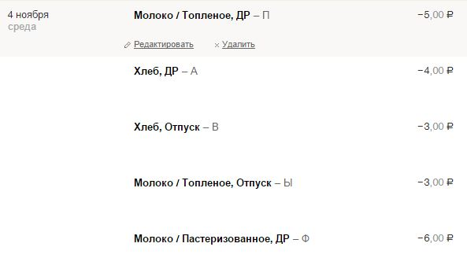
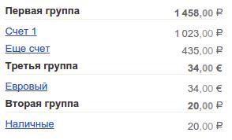

# zentreemap
В отчетах мобильного клиента группировка сумм идет только по первому тегу, а в вебе группируется по кортежу. Данный скрипт корректирует отчет Карта чтобы он учитывал не кортеж а один тег.
После установки скрипта для включения режима кликните по "Группировать по". Состояние вкл/выкл сохраняется в куках, нет необходимости каждый раз кликать.

# zenaccgroups
Позволяет группировать счета в свои группы. Количество групп возможно настроить в исходном коде скрипта. По умолчанию создается три группы. Счета можно таскать мышкой как в группе так и между группами. Двойной клик по группе - изменить имя. Состояние сохраняется в куки.

